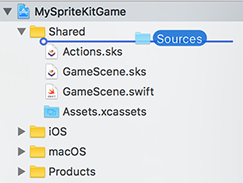
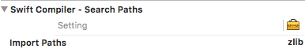

[](https://mfessenden.github.io/SKTiled)

**SKTiled** is a simple library for using [Tiled](http://www.mapeditor.org) files with Apple's SpriteKit, allowing the creation of game assets from .tmx files. Inspired by [TilemapKit](http://tilemapkit.com) and written purely in Swift, I began working on this for a project after the development of TilemapKit was halted. While initially created as an exercise in learning Apple's new programming language, I've decided to open-source it in case others find it helpful.


**SKTiled** supports most Tiled features, with custom features that take advantage of Apple's SpriteKit API. 


Check out the [official documentation](https://mfessenden.github.io/SKTiled).

## Requirements

Xcode 8 and Swift 3. 

See [this branch](https://github.com/mfessenden/SKTiled/tree/swift2) for Swift 2.3+ version.


[](https://travis-ci.org/mfessenden/SKTiled)
[](https://github.com/mfessenden/SKTiled/blob/master/LICENSE)


##Installation

Simply drag the *Sources* directory into your Xcode project, and add the files to your game target:




Alternately, you can include this directory in your project's workspace.

### Linking zlib

You'll need to add a path to the zlib module in your project under **Import Paths:**

*Project > Build Settings > Swift Compiler - Search Paths > Import Paths*

Add the following to the project:

`$(SRCROOT)/Sources`




## Usage

Loading a tilemap is simple:

```swift
if let tilemap = SKTilemap.load(fromFile: "sample-map") {
    scene.addChild(tilemap)
}
```

The included `SKTiledScene` object conforms to the `SKTiledSceneDelegate` protocol and can be used as a template. The tilemap is accessed via the `SKTiledScene.tilemap` property, and should be added as a child of the `SKTiledScene.worldNode` object.


## Working with Tilemaps


**Acessing Layers**

Layers can be accessed by type:

```swift
let tileLayers = tilemap.tileLayers
let objectGroups = tilemap.objectGroups
let imageLayers = tilemap.imageLayers
```

or by name:

```swift
let groundLayer = tilemap.getLayer(named: "Ground") as! SKTileLayer
let objectsGroup = tilemap.getLayer(named: "Objects") as! SKObjectGroup
let hudLayer = tilemap.getLayer(named: "HUD") as! SKImageLayer

if let groundLayer = tilemap.tileLayer(named: "Ground") {
    groundLayer.showGrid = true
}
```

Properties like map size & tile size can be accessed via the `SKTilemap.size` and `SKTilemap.tileSize` properties.


**Accessing Tiles**

There are a number of ways to access and work with tile objects. Tiles 

You can query them from the parent `SKTileLayer` layer or the parent `SKTilemap` node. 

```swift
// access a tile via CGPoint
let tileCoord = CGPoint(x: 7, y: 12)
let tile = groundLayer.tileAt(coord: tileCoord)

// access tile integer coordinates
let tile = groundLayer.tileAt(7, 12)
```

There are many ways to work with tile objects; globally from the `SKTilemap` node:

```swift
// query tiles of a certain type
if let fireTiles = tilemap.getTiles(ofType: "fire") {
    // do something fiery here...
}

// query tiles from all layers
let tiles = tilemap.tilesAt(2, 4)
```

... or from individual layers:

```swift
if let waterTiles = waterLayer.getTiles(withID: 17) {
    // do something watery here
}
```

**Accessing Objects**

`SKTileObject` objects can be returned from both the `SKTilemap` and `SKObjectGroup` nodes:

```swift
let allObjects = tilemap.getObjects()
let allTreeObjects = tilemap.getObjects(named: "Tree")
let allCollisionObjects = tilemap.getObjects(ofType: "Collision")

// get objects from the objects group layer
let entrances = objectsLayer.getObjects(ofType: "Entrance")
```

**Acessing Tile Data**

Tile data is accessible from either the `SKTileSet` object:

```swift
let tileSet = tilemap.getTileset("spritesheet-16x16")
// get data for a specific id
let tileData = tileSet.getTileData(gid: 177)
```


as well as the parent `SKTilemap`:

```swift
let tileData = tilemap.getTileData(gid: 177)
```


## Adding Nodes

Tile data includes texture data, and `SKTile` objects are `SKSpriteNode` subclasses that can be initialized with tileset data:

```swift
let newTile = SKTile(data: tileData)
scene.addChild(newTile)
```

Coordinate information is accessible within each layer via the `TiledLayerObject.pointForCoordinate` method:

```swift
let tilePoint = groundLayer.pointForCoordinate(4, 5)
tile.position = tilePoint
```

New nodes (any `SKNode` type) can be added directly to any layer. All `TiledLayerObject` layer types have convenience methods for adding child nodes with coordinates and z-position.


```swift
let newNode = SKNode()
groundLayer.addChild(newNode, 4, 5, zpos: 100.0)
```


## Animated Tiles

Animated tiles will animate automatically; animated tiles can be accesssed from the tilemap. The `SKTile.pauseAnimation` property can stop/start animations:

```swift
let animatedTiles = tilemap.getAnimatedTiles()

for tile in animatedTiles {
    // pause the current animation
    tile.pauseAnimation = true
}
```

## Custom Properties

Custom properties are supported on all object types, and can be accessed easily:

```swift
let value = groundLayer.getValue(forProperty: "type")
groundLayer.setValue("water", forProperty: "type")
```

To query tiles of a given type:

```swift
let waterTiles = groundLayer.getTiles(ofType: "water")
let allWaterTiles = tilemap.getTiles(ofType: "water")
```

For specific property/value types, query the parent layer:

```swift
let walkableTiles = groundLayer.getTilesWithProperty("walkable", "1")
```

or the tilemap:

```swift
let walkableTiles = tilemap.getTilesWithProperty("walkable", "1")
```

##Features

- iOS & macOS versions
- parses compressed data (base64, zlib, gzip)
- renders all Tiled layer types (tile, object, image)
- custom properties for maps, layers, objects & tiles
- parses inline & external tilesets
- render tile layers as a single sprite
- render animated tiles
- render flipped tiles


##Upcoming Features

- multi-threaded rendering
- generate GKGridGraph graphs based on custom tile attributes (iOS10)
- user-definable cost properties for GKGridGraph nodes (iOS10)
- custom tile classes
- objects containing images

##Acknowledgements
- Decompression functions based on: [GZipSwift](https://github.com/1024jp/GzipSwift)
- [Steffen Itterheim](http://www.learn-cocos2d.com) creator of TilemapKit, the inspiration for this project
- [Kenney Vleugels](http://www.kenney.nl) for use of his spritesheet assets.
- [Amit Patel](http://www-cs-students.stanford.edu/~amitp/gameprog.html) for his excellent tutorials on tile-based game logic
- [Clint Bellanger: Isometric Tiles Math](http://clintbellanger.net/articles/isometric_math/)
