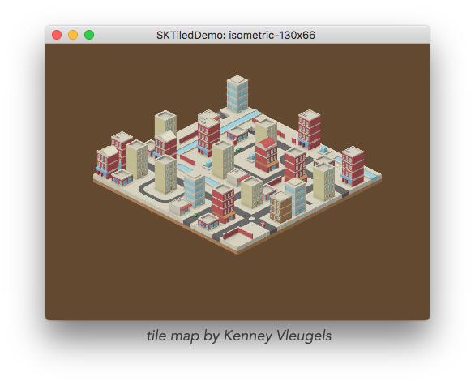

> SKTiled is a Swift framework for using [Tiled](http://www.mapeditor.org) content with Apple's SpriteKit.

[![Swift Version][swift-image]][swift-url]
[![Build Status][travis-image]][travis-url]
[![License][license-image]][license-url]
[![Platforms][platforms-image]][platforms-url]
[![Carthage Compatible][carthage-image]][carthage-url]
[![CocoaPods Compatible][pod-image]][pod-url]


**SKTiled** is a Swift framework for using [Tiled](http://www.mapeditor.org) content with [Apple's SpriteKit][spritekit-url], allowing the creation of game assets from Tiled's .tmx files. Inspired by [TilemapKit](http://tilemapkit.com) and written purely in Swift, I began working on this for a project after the development of TilemapKit was halted. Initially created as an exercise to learn Apple's new programming language, I've decided to open-source it in case others find it helpful.





Check out the [Official Documentation](https://mfessenden.github.io/SKTiled).

## Features

- [x] iOS & macOS versions
- [ ] tvOS version
- [x] parses inline & external tilesets
- [x] translates custom properties for maps, layers, objects & tiles
- [x] renders all projections: (orthogonal, isometric, hexagonal & isometric staggered)
- [x] renders all layer types: (tile, object, image, group)
- [x] supports all compression types: (base64, zlib, gzip)
- [x] renders animated and fliped tiles
- [x] pre-loading of tilesets
- [x] group nodes
- [x] tile objects
- [x] text objects
- [x] custom tile classes (iOS10, macOS 10.11+)
- [ ] generate GKGridGraph graphs from custom attributes (iOS10, macOS 10.11+)
- [ ] user-definable cost properties for GKGridGraph nodes (iOS10, macOS 10.11+)

## Requirements

- iOS 9+
- macOS 10.11+
- Xcode 8

## Installation

### Carthage & CocoaPods Support

For Carthage installation, create a Cartfile in the root of your project:

    github "mfessenden/SKTiled" ~> 1.15


For CocoaPods, install via a reference in your podfile:

    pod 'SKTiled', '~> 1.15'


## Usage

Loading a tilemap is very straightforward:

```swift
if let tilemap = SKTilemap.load(fromFile: "sample-map") {
scene.addChild(tilemap)
}
```
Once loaded, the rendered [`SKTilemap`][sktilemap-url] node reflects the various properties defined in the originating scene:

- `SKTilemap.size`: size of the map in tiles.
- `SKTilemap.tileSize`: size of individual tiles.
- `SKTilemap.orientation`: map orientation (ie orthogonal, isometric, etc).


The [`SKTilemap`][sktilemap-url] node also allows access to child layers, tilesets, objects and individual tiles.

### Working with Layers

Layers represent containers that house various types of data: 

- tile layers hold an array of tile sprites and associated tileset data
- object groups contain vector shape objects
- image layers display a single image

All **SKTiled** layer types are subclasses of the [`TiledLayerObject`][tiledlayerobject-url] class and provide access to coordinate transformation and positioning information. Additionally, every layer type can have individual offset transforms and rendering flags.  

Layers can be accessed by type, name or index:

```swift
// query layers by type
let tileLayers = tilemap.tileLayers
let objectGroups = tilemap.objectGroups
let imageLayers = tilemap.imageLayers
let groupLayers = tilemap.groupLayers

// query named layers
let groundLayers = tilemap.getLayers(named: "Ground") as! [SKTileLayer]
let objectGroups = tilemap.getLayers(named: "Objects") as! [SKObjectGroup]
let hudLayers = tilemap.getLayers(named: "HUD") as! [SKImageLayer]


// query layer at a specific index
if let firstLayer = tilemap.getLayer(atIndex: 1) as! SKTileLayer {
    firstLayer.showGrid = true
}
```

### Working with Tiles

There are a number of ways to access and work with tile objects. Tiles can be queried from the [`SKTilemap`][sktilemap-url] node, or the parent [`SKTileLayer`][sktilelayer-url] layer:

```swift
// access a tile via CGPoint
let tileCoord = CGPoint(x: 7, y: 12)
let tile = groundLayer.tileAt(coord: tileCoord)

// access a tile with integer coordinates
let tile = groundLayer.tileAt(7, 12)
```

Tiles assigned custom properties in **Tiled** can be accessed in **SKTiled**:

```swift
// query tiles of a certain type
if let fireTiles = tilemap.getTiles(ofType: "fire") {
// do something fiery here...
}

// query tiles at a specific coordinate (all layers)
let tiles = tilemap.tilesAt(2, 4)
```

You can also return tiles with a specific ID value:

```swift
if let waterTiles = waterLayer.getTiles(globalID: 17) {
    // do something watery here
}
```

### Working with Objects

`SKTileObject` objects can be queried from both the [`SKTilemap`][sktilemap-url] and [`SKObjectGroup`][skobjectgroup-url] nodes:

```swift
let allObjects = tilemap.getObjects()
let allTreeObjects = tilemap.getObjects(named: "Tree")
let allCollisionObjects = tilemap.getObjects(ofType: "Collision")

// get objects from the objects group layer
let entrances = objectsLayer.getObjects(ofType: "Entrance")
```

### Acessing Tile Data

The [`SKTilemap`][sktilemap-url] node stores an array of individual tilesets parsed from the original **Tiled** document. Individual tile data is accessible from either the [`SKTileSet`][sktileset-url] object:

```swift
let tileSet = tilemap.getTileset("spritesheet-16x16")
// get data for a specific id
let tileData = tileSet.getTileData(globalID: 177)
```

and the parent [`SKTilemap`][sktilemap-url]:

```swift
let tileData = tilemap.getTileData(globalID: 177)
```


## Adding Nodes

Tile data includes texture data, and [`SKTile`][sktile-url] objects are [`SKSpriteNode`][skspritenode-url] subclasses that can be initialized with tileset data:

```swift
let newTile = SKTile(data: tileData)
scene.addChild(newTile)
```

Coordinate information is available from each layer via the `TiledLayerObject.pointForCoordinate` method:

```swift
let tilePoint = groundLayer.pointForCoordinate(4, 5)
tile.position = tilePoint
```

New nodes (any [`SKNode`][sknode-url] type) can be added directly to any layer. All [`TiledLayerObject`][tiledlayerobject-url] layer types have expanded convenience methods for adding child nodes with coordinates and z-position.

```swift
let newNode = SKNode()
groundLayer.addChild(newNode, 4, 5, zpos: 100.0)
```

**SKTiled** also provides methods for getting coordinate data from `UITouch` and `NSEvent` mouse events:

```swift
// get the coordinate at the location of a touch event
let touchLocation: CGPoint = objectsLayer.coordinateAtTouchLocation(touch)
```

## Animated Tiles

Tiles with animation will animate automatically; animated tiles can be accesssed from the either the [`SKTilemap`][sktilemap-url] node or the parent layer. The `SKTile.pauseAnimation` property can stop/start animations:

```swift
// get all animated tiles, including nested layers
let allAnimated = tilemap.animatedTiles(recursive: true)

for tile in allAnimated {
// pause the current animation
tile.pauseAnimation = true
}

// get animated tiles from individual layers
let layerAnimated = groundLayer.animatedTiles()
```


## Custom Properties

Custom properties are supported on all object types. All **SKTiled** objects conform to the [`SKTiledObject`][sktiledobject-url] protocol and allow access to and parsing of custom properties.

Any property added to an object in **Tiled** will be translated and stored in the `SKTiledObject.properties` dictionary.

```swift
let tileType = groundLayer.getValue(forProperty: "type")
groundLayer.setValue("water", forProperty: "type")
```

To query tiles of a given type:

```swift
let waterTiles = groundLayer.getTiles(ofType: "water")
let allWaterTiles = tilemap.getTiles(ofType: "water")
```

For specific property/value types:

```swift
let groundWalkable = groundLayer.getTilesWithProperty("walkable", "1")
let allWalkable = tilemap.getTilesWithProperty("walkable", "1")
```

## Acknowledgments

- [Thorbjørn Lindeijer](https://github.com/bjorn): creator of *Tiled*
- [GZipSwift](https://github.com/1024jp/GzipSwift): zlib decompression extensions
- [Steffen Itterheim](http://www.learn-cocos2d.com): Author of TilemapKit, the inspiration for this project
- [Kenney Vleugels](http://www.kenney.nl): demo spritesheet assets
- [Amit Patel](http://www-cs-students.stanford.edu/~amitp/gameprog.html): tile-based game logic
- [Clint Bellanger: Isometric Tiles Math](http://clintbellanger.net/articles/isometric_math)


[swift-image]:https://img.shields.io/badge/Swift-3.1-brightgreen.svg
[swift-url]: https://swift.org/
[license-image]:https://img.shields.io/badge/License-MIT-blue.svg
[license-url]:https://github.com/mfessenden/SKTiled/blob/master/LICENSE
[travis-image]:https://travis-ci.org/mfessenden/SKTiled.svg?branch=master
[travis-url]:https://travis-ci.org/mfessenden/SKTiled
[platforms-image]:https://img.shields.io/badge/platforms-iOS%20%7C%20macOS-red.svg
[platforms-url]:http://www.apple.com
[carthage-image]:https://img.shields.io/badge/Carthage-compatible-4BC51D.svg
[carthage-url]:https://github.com/Carthage/Carthage
[pod-image]:https://img.shields.io/cocoapods/v/SKTiled.svg
[pod-url]:https://cocoapods.org/pods/SKTiled

<!--- Documentation --->

[sktiled-doc-url]:https://mfessenden.github.io/SKTiled
[sktilemap-url]:https://mfessenden.github.io/SKTiled/Classes/SKTilemap.html
[sktiledobject-url]:https://mfessenden.github.io/SKTiled/Protocols/SKTiledObject.html
[sktile-url]:https://mfessenden.github.io/SKTiled/Classes/SKTile.html
[skobjectgroup-url]:https://mfessenden.github.io/SKTiled/Classes/SKObjectGroup.html
[tiledlayerobject-url]:https://mfessenden.github.io/SKTiled/Classes/TiledLayerObject.html
[sktilelayer-url]:https://mfessenden.github.io/SKTiled/Classes/SKTileLayer.html
[sktileobject-url]:https://mfessenden.github.io/SKTiled/Classes/SKTileObject.html
[sktileset-url]:https://mfessenden.github.io/SKTiled/Classes/SKTileset.html

<!--- Apple --->

[spritekit-url]:https://developer.apple.com/documentation/spritekit
[sknode-url]:https://developer.apple.com/documentation/spritekit/sknode
[skspritenode-url]:https://developer.apple.com/documentation/spritekit/skspritenode
[skscene-url]:https://developer.apple.com/documentation/spritekit/skscene
